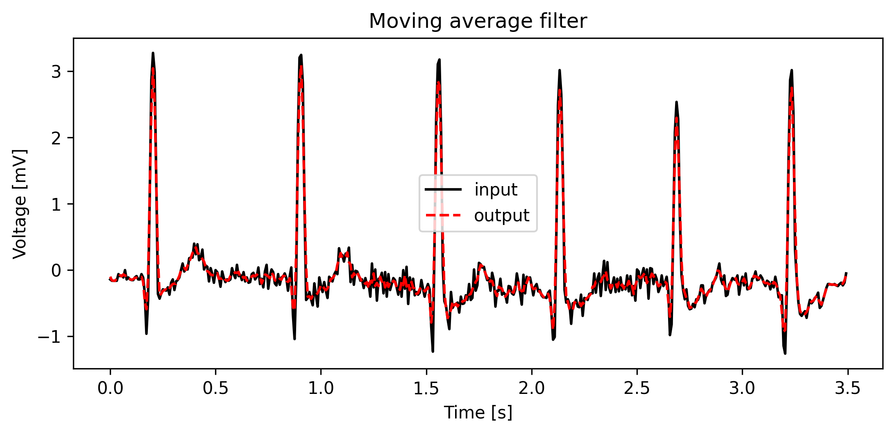

# ECG Tools

A toolbox with common preprocessing methods for ECG signals, such as:
*   Muscular noise removal (linear & moving average methods)
*   Baseline drift removal (median & splines methods)
*   Power Line Interference removal (linear & adaptative notch filters)
*   Isoline correction based on statistical mode (Numpy and Scipy estimation methods)
*   Beat matrix based on R peak positions

## Usage
```python
import ecg_tools
```
### Muscular Noise Removal

```python
ecg_tools.lowpass_filter(
    x, # input ecg
    order, # filter order
    fc, # cut-off frequency
    fs # sampling frequency
)
```


```python
ecg_tools.average_filter(
    x, # input ecg
    size, # window size
)
```


### Baseline Drift Removal

```python
ecg_tools.highpass_filter(
    x, # input ecg
    order, # filter order
    fc, # cut-off frequency
    fs # sampling frequency
)
```


```python
ecg_tools.median_filter(
    x, # input ecg
    size, # window size
)
```


```python
ecg_tools.splines_filter(
    x, # input ecg
    fiducials, # TP/PQ delineation
    size, # window size of fiducial finder,
    order # spline order 
)
```


### Power Line Interference Removal

```python
ecg_tools.notch_filter(
    x, # input ecg
    order, # filter order
    fc, # cut-off frequency
    fs, # sampling frequency
    bw # bandwidth
)
```


```python
ecg_tools.adapt_notch_filter(
    x, # input ecg
    fs, # sampling frequency
    f0, # frequency to adapt
    alpha # adapting rate
)
```


### Isoline correction

```python
ecg_tools.isoline_correction(
    x, # input ecg
    engine, # numpy or scipy for mode estimation
    bins # required if engine = numpy
)
```


### Beat matrix

```python
ecg_tools.beat_matrix(
    x, # input ecg
    r_pos, # r peaks positions
    size # window size
)
```
